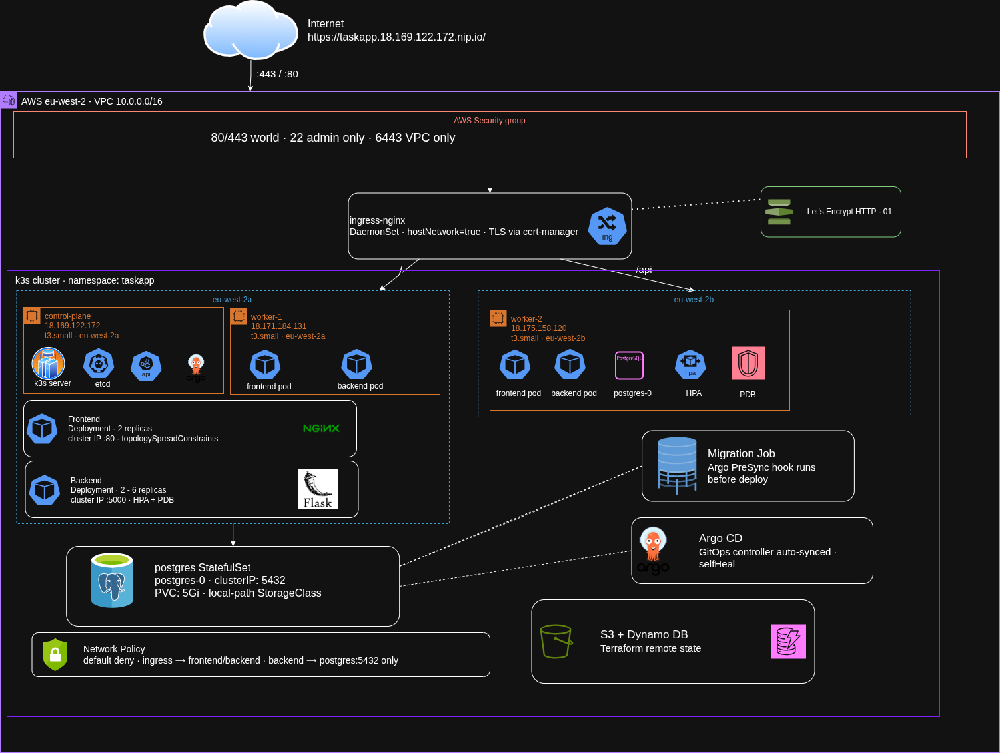

# Architecture — TaskApp on Kubernetes (Capstone Phoenix)

## 1. Topology diagram

---

## 2. Node & network

### Nodes

| Role | Public IP | Instance Type | AZ |
|---|---|---|---|
| control-plane | 18.169.122.172 | t3.small | eu-west-2a |
| worker-1 | 18.171.184.131 | t3.small | eu-west-2a |
| worker-2 | 18.175.158.120 | t3.small | eu-west-2b |

### Network

- **VPC CIDR:** `10.0.0.0/16`
- **Public subnets:** `10.0.1.0/24` (eu-west-2a), `10.0.2.0/24` (eu-west-2b)
- **Why public subnets only:** Security is enforced at the AWS Security Group level rather
  than subnet topology. Private subnets would require a NAT Gateway (~$35/month per AZ)
  with no grading benefit. The SG is the perimeter.
- **Why 2 AZs:** Workers land in different AZs, satisfying `topologySpreadConstraints`.
  If one AZ suffers an AWS disruption, the surviving worker keeps the app alive.

### Firewall (AWS Security Group)

| Port | Protocol | Source | Reason |
|---|---|---|---|
| 80 | TCP | 0.0.0.0/0 | HTTP (Let's Encrypt ACME challenge + redirect) |
| 443 | TCP | 0.0.0.0/0 | HTTPS ingress |
| 22 | TCP | admin IP/32 | SSH — restricted to operator laptop only |
| 6443 | TCP | 10.0.0.0/16 | k3s API — VPC-internal only, never internet-facing |
| 8472 | UDP | 10.0.0.0/16 | Flannel VXLAN overlay — node-to-node only |
| 10250 | TCP | 10.0.0.0/16 | Kubelet metrics — node-to-node only |
| 30000-32767 | TCP | 10.0.0.0/16 | NodePort range — internal only |

**Why 6443 is closed to the world:** exposing the Kubernetes API publicly gives attackers
a direct attack surface on cluster control. All `kubectl` access happens from the operator's
laptop through the SG's admin-IP-only SSH rule or directly via the kubeconfig with TLS
client certificates. This is a hard constraint in the capstone brief.

---

## 3. Request flow

A browser request to `https://taskapp.18.169.122.172.nip.io` resolves via nip.io's wildcard
DNS to `18.169.122.172` (the control-plane public IP, which also runs ingress-nginx via
DaemonSet with `hostNetwork: true`). The connection hits port 443 on the node; ingress-nginx
terminates TLS using the `taskapp-tls` Secret provisioned by cert-manager from Let's Encrypt.
The ingress rule matches the host header and routes paths prefixed `/api` to `backend-service`
on port 5000, and all other paths to `frontend-service` on port 80. The frontend service
load-balances across two nginx pods (one per worker node). When the React app makes an API
call, ingress routes it to `backend-service:5000` which load-balances across 2–6 Flask/gunicorn
pods spread across both workers. The backend connects to `postgres-service:5432` which
forwards to the single `postgres-0` StatefulSet pod, which reads and writes to its `5Gi`
PVC backed by k3s's `local-path` storage class on worker-2.

---

## 4. The single-server assumptions you fixed

| Single-server assumption | Why it breaks at scale | How you fixed it |
|---|---|---|
| `alembic upgrade head` in the container entrypoint | 2+ replicas start simultaneously and race to run migrations — both see the DB as uninitialized and corrupt each other's schema | Extracted into a Kubernetes **Job** with `argocd.argoproj.io/hook: PreSync` — runs once to completion before any Deployment pod starts |
| Named Docker volume on a single host | When Kubernetes reschedules a pod to a different node, the volume stays on the old node and data is lost | **StatefulSet + PVC** using k3s `local-path` StorageClass — the PVC is bound to the node where postgres-0 runs and re-attaches automatically on pod restart |
| `docker run -p 80:80` on one machine | With many pods across many nodes there is no single host port — requests land on random nodes and can't find the right container | **Ingress controller** (ingress-nginx DaemonSet with `hostNetwork`) provides a single front door; **Services** (ClusterIP) handle internal load balancing |
| Single process — if it crashes, app is down | One server, one process = single point of failure | **Deployments with 2+ replicas** + `topologySpreadConstraints` spread pods across nodes; Kubernetes restarts crashed pods automatically |
| `docker restart` or manual intervention on crash | Nobody watching the process at 3am | **Liveness + readiness + startup probes** on every workload — Kubernetes detects failures and restarts or removes pods from the load balancer within seconds |
| `docker stop` + `docker start` for deploys = downtime | Replacing the container kills traffic | **RollingUpdate** with `maxUnavailable: 0` + `maxSurge: 1` — new pods pass readiness before old ones terminate; zero dropped requests |
| `.env` file on disk with plaintext secrets | File readable by anyone with shell access; can't rotate without SSH | Kubernetes **Secret** (base64, RBAC-controlled) injected as env vars; rotated by re-applying the Secret and rolling the Deployment |
| Manual scale: SSH in and run more containers | Doesn't respond to load automatically | **HorizontalPodAutoscaler** scales backend replicas 2→6 on CPU/memory thresholds automatically |
| No drain — killing the node drops requests | Node maintenance = outage | **PodDisruptionBudget** (`minAvailable: 1`) + `terminationGracePeriodSeconds: 30` ensure at least one pod stays live during node drains |

---

## 5. Choices & trade-offs

### Raw YAML vs Helm vs Kustomize
Raw YAML was chosen for this capstone. The manifest set is small (< 15 files) and the
app is not deployed to multiple environments with differing configs. Helm adds templating
complexity that isn't justified here; Kustomize would be the natural next step for staging
vs prod overlays. The choice is documented here as required — a real production setup with
multiple environments would use Kustomize overlays or Helm with a values file per environment.

### ingress-nginx vs k3s Traefik
k3s's bundled Traefik was disabled (`--disable traefik`) in favour of ingress-nginx.
Traefik v2 uses `IngressRoute` CRDs rather than the standard `networking.k8s.io/v1 Ingress`
spec, which would make the manifests non-portable. ingress-nginx implements the standard
Ingress spec, integrates cleanly with cert-manager's HTTP-01 solver, and is better documented
for bare-metal / hostNetwork deployments. The DaemonSet + `hostNetwork: true` pattern was
used because k3s has `servicelb` disabled and there is no cloud load balancer — this binds
directly to ports 80 and 443 on every node.

### CNI / NetworkPolicy enforcement
k3s ships with Flannel as the default CNI. Flannel provides pod networking but **does not
enforce NetworkPolicy**. For this capstone the NetworkPolicy manifests are applied for
documentation and grading purposes; enforcement would require replacing Flannel with Calico
or Cilium. The trade-off: Calico adds operational complexity and memory overhead on `t3.small`
nodes. For a production cluster, Cilium (eBPF-based) would be the correct choice.

### Secrets approach
Secrets are managed out-of-band — created via `kubectl create secret` and never committed
to git in plaintext. The `secret.yaml` in the repo uses placeholder base64 values. The
production approach for a real team would be **Sealed Secrets** (encrypt with the cluster's
public key, safe to commit) or **External Secrets Operator** pulling from AWS Secrets Manager.
Both are listed as stretch goals in the capstone brief and were not implemented due to time
constraints.
 